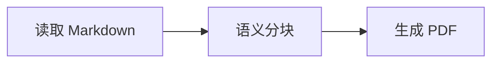

# 用法与样式

```bash
hugemark build input.md -o output.pdf --build-dir .hugemark-build/book
hugemark build input.md -o output.pdf --build-dir .hugemark-build/book --resume
hugemark plan input.md
hugemark build --help
```

`plan` 仅生成分块 HTML 和清单；公式与图表在 `build` 阶段生成。资源相对路径以 Markdown 文件所在目录为基准。默认禁止远程资源；`--allow-remote` 开启后不能使用断点恢复。

## 公式

支持 `$E=mc^2$` 行内公式，`$$...$$` 独立公式，以及 `math`、`tex`、`latex` 围栏代码块：

````markdown
行内公式 $\frac{a}{b}$。

$$
\int_0^\infty e^{-x^2}\,dx = \frac{\sqrt{\pi}}{2}
$$

```math
\begin{aligned}
f(x)&=x^2+2x+1\\
&=(x+1)^2
\end{aligned}
```
````

使用 MathJax 3.2.2 TeX → SVG。每个公式需自包含，不支持文档级宏定义或动态加载 TeX 扩展。错误公式会让构建失败并保留日志；不会悄悄输出错误结果。

## Mermaid

````markdown

````

内置 Mermaid 11.17.2，支持该版本内置的流程图、时序图、状态图、类图、ER 图、甘特图等。具体语法遵循该版本 Mermaid；需要另行加载的外部插件不包含在内。示例见 [advanced.md](../tests/fixtures/advanced.md)。

`--mermaid-theme` 可选 `default`、`neutral`、`dark`、`forest`、`base`。图表以严格模式生成，禁止网络请求及 HTML 标签渲染。图表源码上限 32768 字符，边数量上限 1000。单个复杂公式或图表不可通过拆断语法来缩小；超过预算时应拆成多个完整图表。

`--no-advanced` 可关闭公式/图表转换，保留源文本显示，便于排查。

## 字体、颜色、间距与布局

默认样式来自源码中的 `assets/github.css` 和 `assets/print.css`；代码高亮由 Pygments 生成。修改内置文件需重新编译；日常定制直接使用 `--css theme.css`，无需编译。

```css
@page { size: A4; margin: 20mm; }
.markdown-body { font-size: 11pt; line-height: 1.7; color: #263238; }
.markdown-body h1 { color: #155e75; margin-bottom: 1em; }
```

外部 CSS 最后加载，可覆盖默认规则。CSS 中图片、字体及导入路径相对于 CSS 文件解析。它控制最终打印样式；图表内部布局由 Mermaid 与主题配置决定。

字体参数：`--font-sans`、`--font-serif`、`--font-cjk`、`--font-mono`，`--serif` 选择衬线正文。字体需安装在运行系统中。

## 恢复与调试

构建目录包含清单、原始/预处理 HTML、分块 PDF、组件缓存、尝试日志和合并记录。输入、设置或本地依赖变化会拒绝旧缓存；去掉 `--resume` 重新构建即可。损坏的已完成 PDF 或组件缓存会重建。同一构建目录有跨平台互斥锁。

`--chunk-bytes` 调整分块预算，`--timeout` 指定 Worker 超时秒数，`--retries` 和 `--max-split-depth` 控制重试与拆分。最终输出采用临时文件替换，失败不会留下半成品最终 PDF。
