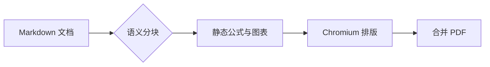
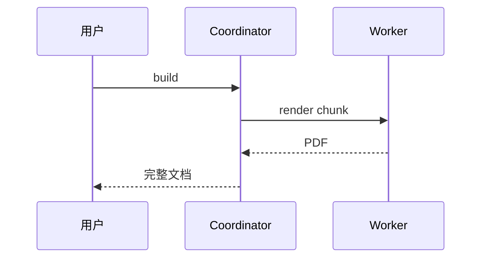
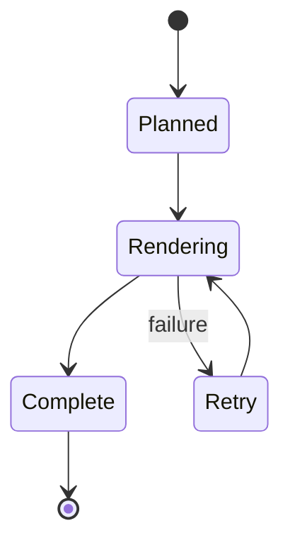

# 公式与图表

行内公式 $E=mc^2$，以及 $\frac{a}{b}+\sqrt{x}$，与中文、English 混排。

$$
\int_0^\infty e^{-x^2}\,dx = \frac{\sqrt{\pi}}{2}
$$

```math
\begin{aligned}
f(x)&=x^2+2x+1\\
&=(x+1)^2
\end{aligned}
```

## 流程图



## 时序图



## 状态图


